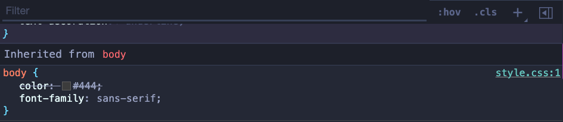

# Overview

This is just practice for me uploading to Github and following along with a course. The idea is to update after learning something each lecture to get in the idea of committing more to the page.

# CHEATS and QUALITY of Life Codes for Coding

## COMPUTER COMMANDS for Mac

`control + command + Q`: shortcut that will take you directly to the lock screen.
`option + z`: formats the text if it goes off page when windowed.
`Command + Shift + V`: Opens Markdown Preview for note taking (press this when on note side).
`Option + Command + i`: Opens dev tools
`COMMENTING CHEAT`: Select your text and press `Command + /`

## Commits

Chase says to check out the conventional commits webpage. But for general usage when committing we can write the following:

`git commit -m "prog(filename): brief description".`

So then a real life example of this in practice would look like this:

`git commit -m "prog(index.html) added basic structure of webpage"`

# Section 1: Welcome and First Steps

## The 3 languages of the Front-end

In a shared venn diagram we have `HTML, CSS, and JS` all intersecting.

## HTML the Noun

In this case `HTML` is the `NOUNS` `<p></p> means paragraph`

## CSS the adjective

`CSS` is the `adjective` `p {color: red}` means "the paragraph text is `red`".

## JS the verb

`JS` are the verbs `p.hide();` means "hide the paragraph"

## Your very first webpage!

Always call your very first page `index.html`.

`! and tab` creates the default information for your html document.

EACH AND EVERY PAGE SHOULD ONLY HAVE 1 `<h1>`..

## Ordered lists, Unordered lists and listed items

`<li>`: stands for listed item.
`<ol>`: is for ordered lists. Meaning each item will have a number next to the listed item.
`<ul>`: is for unordered list. Meaning it will just put dots instead of numbers for the items in the list.

## how to add photos to page

we use `` and it needs a source attribute `src` so it knows where to gather the img from.

`` = contains the source location of the img you're trying to use

`` = describes what the image is about if the image is not available.

`` we can also change the size and height of an image in HTML.

## links

we use `<a></a>` because it stands for `anchor element`.

## How to open the link in a new tab

`<a target="\_blank"></a>`

## How to add a another webpage to the main page

simply create a new webpage and add a hyperlink to the html file

`<a href="blog.html"></a>`: will point to the html we just created.

## How to make links that go nowhere (deadlink)

If you want a link that points no where we type this:

`<a target="#"></a>`: and it goes nowhere like a dead link

## Structuring our HTML

## Header

What is the `header` element? What does it do?

When we want our stuff at the top of the page to be called our webpage header

```
<header>
    <h1></h1>
    <nav>
      <a href="blog.html">Blog</a>
      <a href="#">Challenges</a>
      <a href="blog.html">Blog</a>
      <a href="blog.html">Blog</a>
    </nav>
</header>
```

## HTML entities

`&copy;`: creates the copyright symbol.

## A Note on Semantic HTML

Elements have a meaning. Not all html elements are semantic. Like before with `<b>` it didn't really have a semantic value to it like `<strong>` does.

`<strong>`: its associated as a `bold`.

`<em>`: it means to `emphasize` the word that goes in the middle of the tags.

## Element Containers (Nav, Article,Div, and Aside and their differences)

### <nav>

What does `<nav>` do?: it means `navigation` and it visually doesn't do anything but creates an invisible box that houses the links inside it.

EX:

```
    <nav>
      <a href="blog.html">Blog</a>
      <a href="#">Challenges</a>
      <a href="blog.html">Blog</a>
      <a href="blog.html">Blog</a>
    </nav>
```

### <article>

What does `<article>` element do? it represents a self-contained composition in a document, page, application, or site, which is intended to be independently distributable or reusable.

Ex. include:

forum post, magazine or newspaper article, or blog entry, a product card, a user-submitted comment, an interactive widget or gadget, or any other independent item of content.

```
<article>
  <h2> Kind of similar to div and nav, right? </h2>
</article>
```

### <div>

What does `<div>` do? it is kind of like the nav container where it doesn't do anything visually. We only use `<div>` now when we don't want to attach a certain meaning to a certain container.

```
<div>
    <h2> Kind of similar to article and nav, right?</h2>
</div>
```

### <p> element

`<p>` is semantic because it is for `paragraph`.

### <aside> element

`<aside>` tag defines some content aside from the content it is placed in. The aside content should be indirectly related to the surrounding content.

`Tip`: The `<aside>` content is often placed as a sidebar in a document.

```
<aside>
  <h2> Kind of like nav, article, and div, right? Just slightly different</h2>
</aside>
```

## img's in different file locations

We usually put images in different location than the rest of the information. Kind of like this. Create a new folder called img and store the images inside it.

``

# Section 2: CSS Fundamentals

## Lecture 1: Introduction to CSS

What is `CSS`? `Cascading Style Sheets`: describes the visual style and presentation of the content written in HTML.

How we select and style elements:

```

h1 {
color: blue;
text-align: center;
font-size: 20px;
}

```

`h1`: is the selector
`font-size: 20px;`: Declaration/style
`font-size`: property
`20px`: value

### What is inline-style CSS?

These should never be used. These are just to show us what they are and what they can do. An in-line CSS is when you attach a property to an element and give it a value.

`<h1 style="color:blue">`

### What is an internal CSS?

For internal CSS this is placed at the `head` element of the HTML document and we create a `style` element. Everything that goes inside this element will get styled with CSS.

```
<head>
    <style>
      h1 {
        color: blue;
      }
    </style>
</head>
```

However if we have a lot of CSS code this would load our HTML file too much. This can be used when not a lot of CSS code is needed.

### What is an external CSS file? (POG)

Create a new file. We call this external file `style.css`.

Upon reflection when we change to the external CSS compared to the other styles. Why don't we see the changes right away? It's because we need to link the external file to the main HTML file.

### How do you link an external CSS file to an HTML file?

We link it to the HTML `head` element. Using `link` element. It is not used to create hyper links lmao.
We also use `rel` attribute to say what kind of link this is.

`<link href="style.css" rel="stylesheet">`

## Lecture 2: Styling Text

In this section we will learn a few properties to style CSS.

1. `font-size: 26px`

   - `font-size`: is usually 16px by default until we change it.

2. `Font-family`: can specify different fonts for your text.

- The funny thing about CSS for other computers is just because you have the `font-family` connected to your computer, doesn't mean other people will have it on their computer. So we will need to create a link like we did for the style sheet but for fonts.

4. `text-transform: uppercase`: can turn a text uppercase and other things.

5. `font-style: italic`: can also change the font style.

`NOTE`: Just because we have an `<h1>` on the page, it doesn't mean that it also needs to be the biggest one we could have an `<h2>` with a font-size that's bigger. Being `<h1>` is only about semantics, not about what it looks like.

When we use `p` as the selector it selects all the `p's` in the html document. We can actually specify a new property so the lines don't look so mushed together. This is called `Line-height`.

6. `line-height: 1.5;`: this value means that the line height will be 1.5 times the font size (1.5 x Font-size).By default it is set to `1`.

   Ex.

   ```
   p {
     line-height: 1.5;
   }
   ```

7. `text-align`: can change where the text is placed.
   Ex.

```

h1 {
text-align: center;
}

```

8. `inheritance`: will come back to later.

## Lecture 3: Combining Selectors

When we have selectors that have the same properties we can combine them into one selector list.

### Selector List

```
h1, h2, h3, p, li {
  font-family; sans-serif;
}
```

Once you have them combined into a list, you can remove them from their main CSS selectors.

Here is another way to combine selectors.

### Descendant Selector

```
footer p {
  font-size: 16px;
}
```

This will select all the `p` elements nested inside the `footer` element and give them their style. This will not effect the other `p` elements in the document.

### Nested Descendant Selectors

You can take this another level and add nested descendant selectors. For example. We have the article element and nested inside is a header and inside that header is a p. If we target it like this it will work.

```
article header p {
  font-size: 16px
}
```

Works but gets a little crazy if you continue this structure.

## Lecture 4: Class and ID Selectors

This is how we create an ID selector. Inside the p tag you write the attribute id="author".

```
<p id="author"><p>
```

When we go inside our CSS sheet this is how we would write it. We use `#` followed by the id name of the selector.

```
#author {
  font-style: italic;
}
```

### What is the difference between an ID and a Class?

An `ID`'s name can only be used once while a `Class` can be used multiple times. So its important to know an id can only be used once and not multiple times.
Also the `ID` uses `#` as its selector.
`Class` uses a `.` as its selector.

### Element selector

When you basically use the name of the element to select it in CSS like this

```
aside {
  color: blue;
}
```

### Challenge (remove the bullet points from the listed elements)

How do you remove the bullet points from a list?

```
ul {
  list-style: none;
}
```

For this challenge only remove the bullet points from the Related Posts section. In the real world we never use ID's. We always use Classes because by using Classes we are prepared for the future.

## Lecture 5: Working with Colors

### Color Theory

`RBG Model`: Every color can be represented by a combination of RED, GREEN, BLUE.
Each of the 3 base colors can take a value between 0 and 255, which leads to 16.8 million different colors.

### Two ways of defining colors in CSS

1. RGB/RGBA Notation: this is how we would write out rgb/rgba notation in css. rgb(a) the `a` stands for alpha. Meaning we can use that value to change the transparency of an item when included.

```
rgb(0,255,255)

RGB with transparency ("alpha");
rgba(0,255,255,0.3 )

```

- These two rgb notations are the same, but the one with the alpha has a 0.3 so that means the color is a little brighter.

2. Hexadecimal Notation
   Instead of using a scale from 0 to 255, we go from 0 to ff (255 in hexadecimal numbers).
   #00fffff

Shorthand, when all colors are identical pairs
In practice we mostly use `hexadecimal` colors, and `rgba` when we need transparency.

### Shades of Grey

When colors in all 3 channels are the same, we get a `grey color`
There are 256 pure grays to choose from

```
rgb (0,0,0) / #000000 / #000
rgb (69,69,69) /#444444 / #444 (this is great for text color)
rgb (183,183,183) / #b7b7b7
rgb (255,255,255) / #ffffff / #fff
```

### Background color

```
header {
  background-color: #f7f7f7;
}
```

### Borders

What we want to do is add some border to the related posts section. At the bottom and top a blue border.

```
aside {
  background-color: #f7f7f7;
  border: 5px solid #1098ad;
}
```

- This does apply the border, but it also applies the border to the left and right which we don't want. Here are some different variants of the border property.

### Special variants of Border

`Border-top`: applies border to top;
`Border-bottom`: applies border to bottom;
`Border-left`: applies border to left;
`Border-right`: applies border to right;

```
border-top: 5px solid #1098ad;
border-bottom: 5px solid #1098ad;
```

## Lecture 6: Pseudo-classes

In the example he wants to make the first li element bold for both of the lists. He offered a first way of adding classes to the first elements in these lists manually:

```
  <li class="first-li">
```

And this of course works. But there is also a better way to do this instead of doing this manually and let CSS figure this out automatically for us. This is with the usage of `pseudo-classes`.

### :first-child

A pseudo class we can use `:first-child`. And this basically changes our selector here and adds a `li:first-child` (pseudo class) to it. What `:first-child` does it that it will select all li elements that are the first-child elements of its parent elements.

```
li:first-child {
  font-weight: bold;
}
```

### :last-child

The same also works for `:last-child` It selects the last element of its parent element.

```
li:last-child {
  font-style: italic;
}
```

### :nth-child(n)

What about if we wanted to select the 2nd, 3rd of middle element?

So here we use `:nth-child(n)`. Inside the parenthesis we put the child element that we want to select.

```
li:nth-child(2) {
  font-size: 23px;
}
```

We can also use keywords inside the parenthesis. We can type out `nth:child(odd)` and it will select the odd elements. Same works for `nth:child(even)`

### Common misconceptions with pseudo-classes

If we were to try to change the color of articles first p element and wrote it like this:

```
article p:first-child {
  color: red;
}
```

This would not work. Because in our example p is not the first element in our article element. It is actually second. So pseudo classes will only work if the conditions are correct. Try it again by making a p the first element. Therefore now our selector applies.

When we mix multiple elements inside of a parent element, then the pseudo classes don't work really well. However they are perfect when all the child elements are the same. Like in a `<ol>` and `<ul>`.

## Lecture 7: Styling Hyperlinks /w Pseudo Classes

### :link

Let's style the `:link` pseudo class

```
a:link {
  color: #1098ad;
}
```

This one only targets actual links.

### text-decoration

gets rid of the lines underneath the link

```
a:link {
  color: #1098ad;
  text-decoration: none;
}
```

### :visited

Normally we keep `:link` and `:visited` grouped up in our CSS rule sheet, but for this example we will keep them apart. Generally we keep the `:visited` link color the same as the `:link`.

```
a:visited {
color: #1098ad
}
```

### :hover (this one is one of the most important)

With text-decoration we can change its: `line, style, color, and text-thickness`.

```
a:hover {
  text-decoration: underline wavy orangered;
}
```

### :Active (the state of actually clicking a link)

```
a:active {
  background-color: black;
  font-style: italic;
}
```

Now when you click on the link this is what it will do.

### L.V.H.A: Link, Visited, Hover, Active

Good way to remember the state of links is `L.V.H.A`
They are also defined in this order.

## Lecture 8: Using Chrome DevTools

Currently there are 3 ways to open `Dev Tools`

- right click anywhere on page > `inspect tools`
- go to `view` > `developer` > `developer tools`
- or simply `option + command + i`

Inside `Dev Tools` we can pretty much see all the HTML we have produced on the page. It also shows us when we click on an element the styles it has and much more.

We can also add more styles for practice to the element and it won't mess with the real code. All you have to do is refresh the page and it's gone.

### Styles [Force Element State]

Inside the `Dev Tools` there is a `Styles` section. Within that section they have an option called `Force Element State`. Within this state they have options for forcing: `:active, :focus, :focus-within, :target, :hover, :visited, :focus-visible`

You can toggle these states for an element and it will reflect that on the page without having to actually interact with the element with your mouse. For example, we used `:active` on the `force state` and when we looked at the link on the page it was showing the active link as if it was clicked.

It is a good idea to play around with these states to get more familiar with the `Dev Tools`.

## Lecture 9: CSS Theory #1: Conflicts between Selectors

This section contains 5 theories.

### Conflicting Selectors and Declarations

```
<p id="author-text" class="author">
    Posted by <strong>Laura Jones</strong> on Monday, June 21st 2027
</p>
```

```
.author {
  font-style: italic;
  font-size: 18px;
}

#author-text {
  font-size: 20px;
}
p, li {
  font-family: sans-serif;
  color: #444444
  font-size: 22px;
}
```

In this case, there are multiple selectors selecting the same element. Which one of them applies?

All rules and properties are applied. But we can see there are conflicting font-size declarations! Is it 18px, 20px, or 22px?
Let's see how it works.

When there are multiple declarations for the same selectors.

### Resolving Conflicting Declarations

`IDs (#) > Class (.) or Pseudo-class (:) > element selectors`

1. `ID (#) Selector`: if there are multiple, then the last selector in code applies.
   - ID's have the highest priority
2. `Class (.) or pseudo-class (:) selector` and if there are multiple the last selector in code applies.
   - these have second priority
3. `Element selector (p, div, li, etc.)`: if there are no classes or pseudo class selectors
4. Universal selector (lowest priority of them all)

`FOR THE CONFLICTING FONT-SIZE PROPERTY` So the answer to who takes precedence for this situation it is the ID selector that applies.

### Another note on conflicting declarations

Another note on this. Declarations marked (!important)and Inline-style (style attribute in HTML) have a higher priority than ID selectors. We never use !important or inline-style anyways, but this is good to know just in case:

`Declarations marked (important) > Inline-style > IDs (#) > Class (.) or Pseudo-class (:) > element selectors`

### We can add multiple classes to the same element

```
<p class="author time">
```

Just put a space in between the classes.
Back to resolving conflicts we see when we hover over the selectors what priority they have:

```
#copyright {
  color: red;
}
(Selector specificity (1,0,0))
.copyright {
  color: blue;
}
(Selector specificity (0,1,0))
.text {
  color: yellow;
}
(Selector specificity (0,1,0))
footer p {
  color: green;
}
(Selector specificity (0,0,2))
```

If we turned off the ID selector, which would take next priority? The `text` class would because it was applied after the other.

If we use

```
footer p {
  color: green !important;
}
```

This will be what is shown on the page. Since !important is highest priority. We don't use this though.

## Lecture 10: CSS Theory #2: Inheritance and the Universal Selector

### Body and Inheritance

`<body>` is the main parent for the HTML document.
`Inheritance`: is the mechanism by which some styles so some properties get their values inherited from parent elements to child elements. - they have the lowest priority.



This is why we use the technique of putting these properties that are related to text to the body, okay? Because these are the ones that we then want all of the elements on the page to have.

```
body {
  color: #444;
  font-size: 16px;
  font-family: sans-serif;

  border-top: 10px solid blue;
}
```

In this example elements would inherit: `color, font-size, and font-family` because they are related to text. `Border-top` would not because it is not related to text.

### Properties that are related to text and get inheritance

`font-family, font-size, font-weight, font-style, color, line-height, letter-spacing, text-align, text-transform, text-shadow, list-style, etc.

### Universal Selector

`*`: This is the sign for a universal selector. When we want a certain property applied to all elements but for them not to be inherited. This has the lowest priority.

```
* {
  border-top: 10px solid blue;
}
```

This would apply a border-top to all elements, but yeah we wouldn't want to do that lol.
