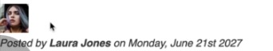
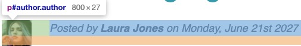
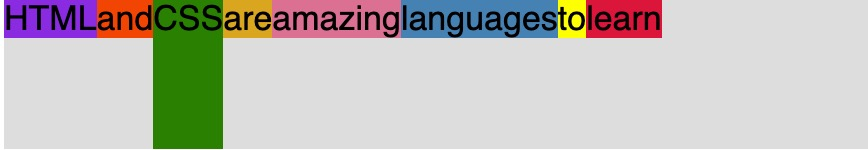

# Overview

This is just practice for me uploading to Github and following along with a course. The idea is to update after learning something each lecture to get in the idea of committing more to the page.

# CHEATS and QUALITY of Life Codes for Coding

## COMPUTER COMMANDS for Mac

`control + command + Q`: shortcut that will take you directly to the lock screen.
`option + z`: formats the text if it goes off page when windowed.
`Command + Shift + V`: Opens Markdown Preview for note taking (press this when on note side).
`Option + Command + i`: Opens dev tools
`COMMENTING CHEAT`: Select your text and press `Command + /`

## Commits

Chase says to check out the conventional commits webpage. But for general usage when committing we can write the following:

`git commit -m "prog(filename): brief description".`

So then a real life example of this in practice would look like this:

`git commit -m "prog(index.html) added basic structure of webpage"`

# Section 1: Welcome and First Steps

## The 3 languages of the Front-end

In a shared venn diagram we have `HTML, CSS, and JS` all intersecting.

## HTML the Noun

In this case `HTML` is the `NOUNS` `<p></p> means paragraph`

## CSS the adjective

`CSS` is the `adjective` `p {color: red}` means "the paragraph text is `red`".

## JS the verb

`JS` are the verbs `p.hide();` means "hide the paragraph"

## Your very first webpage!

Always call your very first page `index.html`.

`! and tab` creates the default information for your html document.

EACH AND EVERY PAGE SHOULD ONLY HAVE 1 `<h1>`..

## Ordered lists, Unordered lists and listed items

`<li>`: stands for listed item.
`<ol>`: is for ordered lists. Meaning each item will have a number next to the listed item.
`<ul>`: is for unordered list. Meaning it will just put dots instead of numbers for the items in the list.

## how to add photos to page

we use `` and it needs a source attribute `src` so it knows where to gather the img from.

`` = contains the source location of the img you're trying to use

`` = describes what the image is about if the image is not available.

`` we can also change the size and height of an image in HTML.

## links

we use `<a></a>` because it stands for `anchor element`.

## How to open the link in a new tab

`<a target="\_blank"></a>`

## How to add a another webpage to the main page

simply create a new webpage and add a hyperlink to the html file

`<a href="blog.html"></a>`: will point to the html we just created.

## How to make links that go nowhere (deadlink)

If you want a link that points no where we type this:

`<a target="#"></a>`: and it goes nowhere like a dead link

## Structuring our HTML

## Header

What is the `header` element? What does it do?

When we want our stuff at the top of the page to be called our webpage header

```
<header>
    <h1></h1>
    <nav>
      <a href="blog.html">Blog</a>
      <a href="#">Challenges</a>
      <a href="blog.html">Blog</a>
      <a href="blog.html">Blog</a>
    </nav>
</header>
```

## HTML entities

`&copy;`: creates the copyright symbol.

## A Note on Semantic HTML

Elements have a meaning. Not all html elements are semantic. Like before with `<b>` it didn't really have a semantic value to it like `<strong>` does.

`<strong>`: its associated as a `bold`.

`<em>`: it means to `emphasize` the word that goes in the middle of the tags.

## Element Containers (Nav, Article,Div, and Aside and their differences)

### <nav>

What does `<nav>` do?: it means `navigation` and it visually doesn't do anything but creates an invisible box that houses the links inside it.

EX:

```
    <nav>
      <a href="blog.html">Blog</a>
      <a href="#">Challenges</a>
      <a href="blog.html">Blog</a>
      <a href="blog.html">Blog</a>
    </nav>
```

### <article>

What does `<article>` element do? it represents a self-contained composition in a document, page, application, or site, which is intended to be independently distributable or reusable.

Ex. include:

forum post, magazine or newspaper article, or blog entry, a product card, a user-submitted comment, an interactive widget or gadget, or any other independent item of content.

```
<article>
  <h2> Kind of similar to div and nav, right? </h2>
</article>
```

### <div>

What does `<div>` do? it is kind of like the nav container where it doesn't do anything visually. We only use `<div>` now when we don't want to attach a certain meaning to a certain container.

```
<div>
    <h2> Kind of similar to article and nav, right?</h2>
</div>
```

### <p> element

`<p>` is semantic because it is for `paragraph`.

### <aside> element

`<aside>` tag defines some content aside from the content it is placed in. The aside content should be indirectly related to the surrounding content.

`Tip`: The `<aside>` content is often placed as a sidebar in a document.

```
<aside>
  <h2> Kind of like nav, article, and div, right? Just slightly different</h2>
</aside>
```

## img's in different file locations

We usually put images in different location than the rest of the information. Kind of like this. Create a new folder called img and store the images inside it.

``

# Section 2: CSS Fundamentals

## Lecture 1: Introduction to CSS

What is `CSS`? `Cascading Style Sheets`: describes the visual style and presentation of the content written in HTML.

How we select and style elements:

```

h1 {
color: blue;
text-align: center;
font-size: 20px;
}

```

`h1`: is the selector
`font-size: 20px;`: Declaration/style
`font-size`: property
`20px`: value

### What is inline-style CSS?

These should never be used. These are just to show us what they are and what they can do. An in-line CSS is when you attach a property to an element and give it a value.

`<h1 style="color:blue">`

### What is an internal CSS?

For internal CSS this is placed at the `head` element of the HTML document and we create a `style` element. Everything that goes inside this element will get styled with CSS.

```
<head>
    <style>
      h1 {
        color: blue;
      }
    </style>
</head>
```

However if we have a lot of CSS code this would load our HTML file too much. This can be used when not a lot of CSS code is needed.

### What is an external CSS file? (POG)

Create a new file. We call this external file `style.css`.

Upon reflection when we change to the external CSS compared to the other styles. Why don't we see the changes right away? It's because we need to link the external file to the main HTML file.

### How do you link an external CSS file to an HTML file?

We link it to the HTML `head` element. Using `link` element. It is not used to create hyper links lmao.
We also use `rel` attribute to say what kind of link this is.

`<link href="style.css" rel="stylesheet">`

## Lecture 2: Styling Text

In this section we will learn a few properties to style CSS.

1. `font-size: 26px`

   - `font-size`: is usually 16px by default until we change it.

2. `Font-family`: can specify different fonts for your text.

- The funny thing about CSS for other computers is just because you have the `font-family` connected to your computer, doesn't mean other people will have it on their computer. So we will need to create a link like we did for the style sheet but for fonts.

4. `text-transform: uppercase`: can turn a text uppercase and other things.

5. `font-style: italic`: can also change the font style.

`NOTE`: Just because we have an `<h1>` on the page, it doesn't mean that it also needs to be the biggest one we could have an `<h2>` with a font-size that's bigger. Being `<h1>` is only about semantics, not about what it looks like.

When we use `p` as the selector it selects all the `p's` in the html document. We can actually specify a new property so the lines don't look so mushed together. This is called `Line-height`.

6. `line-height: 1.5;`: this value means that the line height will be 1.5 times the font size (1.5 x Font-size).By default it is set to `1`.

   Ex.

   ```
   p {
     line-height: 1.5;
   }
   ```

7. `text-align`: can change where the text is placed.
   Ex.

```

h1 {
text-align: center;
}

```

8. `inheritance`: will come back to later.

## Lecture 3: Combining Selectors

When we have selectors that have the same properties we can combine them into one selector list.

### Selector List

```
h1, h2, h3, p, li {
  font-family; sans-serif;
}
```

Once you have them combined into a list, you can remove them from their main CSS selectors.

Here is another way to combine selectors.

### Descendant Selector

```
footer p {
  font-size: 16px;
}
```

This will select all the `p` elements nested inside the `footer` element and give them their style. This will not effect the other `p` elements in the document.

### Nested Descendant Selectors

You can take this another level and add nested descendant selectors. For example. We have the article element and nested inside is a header and inside that header is a p. If we target it like this it will work.

```
article header p {
  font-size: 16px
}
```

Works but gets a little crazy if you continue this structure.

## Lecture 4: Class and ID Selectors

This is how we create an ID selector. Inside the p tag you write the attribute id="author".

```
<p id="author"><p>
```

When we go inside our CSS sheet this is how we would write it. We use `#` followed by the id name of the selector.

```
#author {
  font-style: italic;
}
```

### What is the difference between an ID and a Class?

An `ID`'s name can only be used once while a `Class` can be used multiple times. So its important to know an id can only be used once and not multiple times.
Also the `ID` uses `#` as its selector.
`Class` uses a `.` as its selector.

### Element selector

When you basically use the name of the element to select it in CSS like this

```
aside {
  color: blue;
}
```

### Challenge (remove the bullet points from the listed elements)

How do you remove the bullet points from a list?

```
ul {
  list-style: none;
}
```

For this challenge only remove the bullet points from the Related Posts section. In the real world we never use ID's. We always use Classes because by using Classes we are prepared for the future.

## Lecture 5: Working with Colors

### Color Theory

`RBG Model`: Every color can be represented by a combination of RED, GREEN, BLUE.
Each of the 3 base colors can take a value between 0 and 255, which leads to 16.8 million different colors.

### Two ways of defining colors in CSS

1. RGB/RGBA Notation: this is how we would write out rgb/rgba notation in css. rgb(a) the `a` stands for alpha. Meaning we can use that value to change the transparency of an item when included.

```
rgb(0,255,255)

RGB with transparency ("alpha");
rgba(0,255,255,0.3 )

```

- These two rgb notations are the same, but the one with the alpha has a 0.3 so that means the color is a little brighter.

2. Hexadecimal Notation
   Instead of using a scale from 0 to 255, we go from 0 to ff (255 in hexadecimal numbers).
   #00fffff

Shorthand, when all colors are identical pairs
In practice we mostly use `hexadecimal` colors, and `rgba` when we need transparency.

### Shades of Grey

When colors in all 3 channels are the same, we get a `grey color`
There are 256 pure grays to choose from

```
rgb (0,0,0) / #000000 / #000
rgb (69,69,69) /#444444 / #444 (this is great for text color)
rgb (183,183,183) / #b7b7b7
rgb (255,255,255) / #ffffff / #fff
```

### Background color

```
header {
  background-color: #f7f7f7;
}
```

### Borders

What we want to do is add some border to the related posts section. At the bottom and top a blue border.

```
aside {
  background-color: #f7f7f7;
  border: 5px solid #1098ad;
}
```

- This does apply the border, but it also applies the border to the left and right which we don't want. Here are some different variants of the border property.

### Special variants of Border

`Border-top`: applies border to top;
`Border-bottom`: applies border to bottom;
`Border-left`: applies border to left;
`Border-right`: applies border to right;

```
border-top: 5px solid #1098ad;
border-bottom: 5px solid #1098ad;
```

## Lecture 6: Pseudo-classes

In the example he wants to make the first li element bold for both of the lists. He offered a first way of adding classes to the first elements in these lists manually:

```
  <li class="first-li">
```

And this of course works. But there is also a better way to do this instead of doing this manually and let CSS figure this out automatically for us. This is with the usage of `pseudo-classes`.

### :first-child

A pseudo class we can use `:first-child`. And this basically changes our selector here and adds a `li:first-child` (pseudo class) to it. What `:first-child` does it that it will select all li elements that are the first-child elements of its parent elements.

```
li:first-child {
  font-weight: bold;
}
```

### :last-child

The same also works for `:last-child` It selects the last element of its parent element.

```
li:last-child {
  font-style: italic;
}
```

### :nth-child(n)

What about if we wanted to select the 2nd, 3rd of middle element?

So here we use `:nth-child(n)`. Inside the parenthesis we put the child element that we want to select.

```
li:nth-child(2) {
  font-size: 23px;
}
```

We can also use keywords inside the parenthesis. We can type out `nth:child(odd)` and it will select the odd elements. Same works for `nth:child(even)`

### Common misconceptions with pseudo-classes

If we were to try to change the color of articles first p element and wrote it like this:

```
article p:first-child {
  color: red;
}
```

This would not work. Because in our example p is not the first element in our article element. It is actually second. So pseudo classes will only work if the conditions are correct. Try it again by making a p the first element. Therefore now our selector applies.

When we mix multiple elements inside of a parent element, then the pseudo classes don't work really well. However they are perfect when all the child elements are the same. Like in a `<ol>` and `<ul>`.

## Lecture 7: Styling Hyperlinks /w Pseudo Classes

### :link

Let's style the `:link` pseudo class

```
a:link {
  color: #1098ad;
}
```

This one only targets actual links.

### text-decoration

gets rid of the lines underneath the link

```
a:link {
  color: #1098ad;
  text-decoration: none;
}
```

### :visited

Normally we keep `:link` and `:visited` grouped up in our CSS rule sheet, but for this example we will keep them apart. Generally we keep the `:visited` link color the same as the `:link`.

```
a:visited {
color: #1098ad
}
```

### :hover (this one is one of the most important)

With text-decoration we can change its: `line, style, color, and text-thickness`.

```
a:hover {
  text-decoration: underline wavy orangered;
}
```

### :Active (the state of actually clicking a link)

```
a:active {
  background-color: black;
  font-style: italic;
}
```

Now when you click on the link this is what it will do.

### L.V.H.A: Link, Visited, Hover, Active

Good way to remember the state of links is `L.V.H.A`
They are also defined in this order.

## Lecture 8: Using Chrome DevTools

Currently there are 3 ways to open `Dev Tools`

- right click anywhere on page > `inspect tools`
- go to `view` > `developer` > `developer tools`
- or simply `option + command + i`

Inside `Dev Tools` we can pretty much see all the HTML we have produced on the page. It also shows us when we click on an element the styles it has and much more.

We can also add more styles for practice to the element and it won't mess with the real code. All you have to do is refresh the page and it's gone.

### Styles [Force Element State]

Inside the `Dev Tools` there is a `Styles` section. Within that section they have an option called `Force Element State`. Within this state they have options for forcing: `:active, :focus, :focus-within, :target, :hover, :visited, :focus-visible`

You can toggle these states for an element and it will reflect that on the page without having to actually interact with the element with your mouse. For example, we used `:active` on the `force state` and when we looked at the link on the page it was showing the active link as if it was clicked.

It is a good idea to play around with these states to get more familiar with the `Dev Tools`.

## Lecture 9: CSS Theory #1: Conflicts between Selectors

This section contains 5 theories.

### Conflicting Selectors and Declarations

```
<p id="author-text" class="author">
    Posted by <strong>Laura Jones</strong> on Monday, June 21st 2027
</p>
```

```
.author {
  font-style: italic;
  font-size: 18px;
}

#author-text {
  font-size: 20px;
}
p, li {
  font-family: sans-serif;
  color: #444444
  font-size: 22px;
}
```

In this case, there are multiple selectors selecting the same element. Which one of them applies?

All rules and properties are applied. But we can see there are conflicting font-size declarations! Is it 18px, 20px, or 22px?
Let's see how it works.

When there are multiple declarations for the same selectors.

### Resolving Conflicting Declarations

`IDs (#) > Class (.) or Pseudo-class (:) > element selectors`

1. `ID (#) Selector`: if there are multiple, then the last selector in code applies.
   - ID's have the highest priority
2. `Class (.) or pseudo-class (:) selector` and if there are multiple the last selector in code applies.
   - these have second priority
3. `Element selector (p, div, li, etc.)`: if there are no classes or pseudo class selectors
4. Universal selector (lowest priority of them all)

`FOR THE CONFLICTING FONT-SIZE PROPERTY` So the answer to who takes precedence for this situation it is the ID selector that applies.

### Another note on conflicting declarations

Another note on this. Declarations marked (!important)and Inline-style (style attribute in HTML) have a higher priority than ID selectors. We never use !important or inline-style anyways, but this is good to know just in case:

`Declarations marked (important) > Inline-style > IDs (#) > Class (.) or Pseudo-class (:) > element selectors`

### We can add multiple classes to the same element

```
<p class="author time">
```

Just put a space in between the classes.
Back to resolving conflicts we see when we hover over the selectors what priority they have:

```
#copyright {
  color: red;
}
(Selector specificity (1,0,0))
.copyright {
  color: blue;
}
(Selector specificity (0,1,0))
.text {
  color: yellow;
}
(Selector specificity (0,1,0))
footer p {
  color: green;
}
(Selector specificity (0,0,2))
```

If we turned off the ID selector, which would take next priority? The `text` class would because it was applied after the other.

If we use

```
footer p {
  color: green !important;
}
```

This will be what is shown on the page. Since !important is highest priority. We don't use this though.

## Lecture 10: CSS Theory #2: Inheritance and the Universal Selector

### Body and Inheritance

`<body>` is the main parent for the HTML document.
`Inheritance`: is the mechanism by which some styles so some properties get their values inherited from parent elements to child elements

- they have the lowest priority.


This is why we use the technique of putting these properties that are related to text to the body, okay? Because these are the ones that we then want all of the elements on the page to have.

```
body {
  color: #444;
  font-size: 16px;
  font-family: sans-serif;

  border-top: 10px solid blue;
}
```

In this example elements would inherit: `color, font-size, and font-family` because they are related to text. `Border-top` would not because it is not related to text.

### Properties that are related to text and get inheritance

`font-family, font-size, font-weight, font-style, color, line-height, letter-spacing, text-align, text-transform, text-shadow, list-style, etc.

### Universal Selector

`*`: This is the sign for a universal selector. When we want a certain property applied to all elements but for them not to be inherited. This has the lowest priority.

```
* {
  border-top: 10px solid blue;
}
```

This would apply a `border-top` to all elements, but yeah we wouldn't want to do that lol.

## Lecture 11: Challenge #1

We are building on the `Converse Chuck Taylor All Star Low Top` webpage that we built on `codepen.io`. Also for a bonus, we could do the same for the `Spooky Halloween page`.

### What did you miss in the challenge?

#### :active and :visited to the link

1. Forgot to add the :active, and :visited states to the link

#### cursor property

2. He didn't teach us yet, but a property that was used for button portion of the video is called `cursor`.

```
cursor: pointer;
```

This makes it so a little hand instead of a mouse click appears when you move over the button.

#### Classes vs. Pseudo-classes

He used `class` for most of his elements, where as I used `pseudo-class` for article. He said as long as it looks the same it doesn't matter how we got it. I will look more to adding classes to regular elements. And using pseudo classes more for the `ul`/`ol` elements that have similar child elements.

## Lecture 12: CSS Theory #3: The CSS Box Model (Most fundamental part of CSS)

### What is the CSS Box Model?

These are several components that make up the Box Model:


`content`: text, images, etc. Using `CSS properties` we can specify the height and the width of the content area.
`border`: a line around the element, still <strong>inside</strong> of the element.
`padding`: invisible space around the content, <strong>inside</strong> of the element.
`margin`: Space <strong>outside</strong> of the element, between elements.
`Fill area`: Area that gets filled with `background-color` or `background-image`.

All of these are optional. We don't have to specify paddings or a border or margins. So we can define none of them or some, or even all of them. It all depends on how we want our layout to look like.

### Analogy for the CSS Box Model


`Content`: Imagine a frame on the wall. In this analogy, the drawing or the image that is in the frame is the content area.

`Padding`: Then, many frames actually have this kind of white paper between the drawing or the image and the actual frame itself. The space between the content area and the border (this would be the padding).

`Border`: In this analogy, the frame is of course the border

`Margin`: when we hang the picture on the wall using a frame like this, then of course there might be some space between other elements on the wall or even some other walls on the sides. In the box model this would be margin.

### Element Height and Width Calculation

`Final element width` = left border + left padding + width + right padding + right border

`Final element height` = top border + top padding + height + bottom padding + bottom border

Margin does not account for this. It is just the space around them.

👉 We can specify all these values using CSS properties.
👉 This is the `default behavior`, but we can change it

## Lecture 13: Using Margins and Paddings

Let's start applying the box model in practice. We can start with padding. A perfect candidate for that in our example is the header element that has background-color. Which can always use some padding in order to create some space between the content and the outside of the element.

When inspecting the main-header in dev tools. The orange outline is the `margin` around the element. The green space around the header is the `padding`.

### How to use different paddings (Shorthand)

Let's apply some padding to the .main-header. For example:

```
.main-header {
  padding: 20px;
  padding-left: 40px;
  padding-right: 40px;
}
```

Another way this could be written is:

```
padding: 20px 40px;
```

Using this example is an of `shorthand`. The `20px` is the `top + bottom`. The 40px is the `left + right`.

For our next example we will fix the li elements. Notice how they are close to eachother? Let's add some margin to the bottom.

```
li {

margin-bottom: 10px;
}
```

This works perfectly but we dont want the last li to have that space between it and the next information on the page. Using this will nullify the margin-bottom:

```
li:last-child {
margin-bottom: 0;

}
```

Whenever we use 0 we do not specify any unit. We just say 0 and that will override it.

### Global reset

Notice how there are a lot of spaces? There are a slot of default margins and paddings. How do you think we can set them all to 0? We need to use the universal selector.

```
* {
  margin: 0;
  padding: 0;
}
```

Doing global reset is extremely common. So this is usually the first thing we should do whenever we start any new project. Keep in mind that this is extremely easy to overwrite. So every other selector will actually overwrite this universal selector.

It is most common to use mostly space at the bottom of an element in order to create vertical space.
After applying the universal selector now we can style the page how we want. Notice how the h2 element and the header are too close to each other? It looks bad lets fix it.

```
.main-header {
  background-color: #f7f7f7;
  padding: 20px 40px;
  margin-bottom: 60px;
}
```

### The spacing on the ol/ul elements

Notice how after we removed the margin how they stick super close to the page and their bullet points and numbers are gone? We simply need to add `margin-left` to them.

```
ol, ul {
  margin-left: 50px;
}
```

### Collapsing Margins

our h3 and the link look like the space between them is exactly the same and we don't want that.

This is when we have two margins that occupied the same space, only one of them is actually visible on the page. And that is usually the larger of the two.

### Quick Re-cap

Whenever you need some space inside of an element, which is very useful, mostly when there is a `background color` or a `border` on the element, then you always use `padding`.

On the other hand, in order to create space outside of an element, or also to create some space between multiple elements, always use `margin`. And in that case if you need to add `vertical space` then I advise you to most of the time stick to `margin-bottom`.

## Lecture 14: Adding Dimensions

Let's start with our `<aside></aside>` element, which will eventually be our side bar. Lets specify the width as `500px`.

```
aside {
  width: 500px;
}
```

### Height and HTML vs Height and CSS

It is very common to size images in `CSS` and not in the `HTML` like we did. Actually many times, we never even specify the width of images in `HTML` but only in `CSS`.

In case we do have the height specified in `HTML`, what we need to do is to then set the `height` to `auto`. This will then fix it and will put the aspect ratio back to the original.

```
.post-image {
  width: 800px;
  height: auto;
}
```

But again, specifying the `height` and setting it to auto is only necessary if that `height` is already specified before in `HTML`.

### Using Percentages

Let's actually move away from `pixels` for the first time and use `percentages`. So I can say the width like this:

```
.post-image {
  width: 100%;
  height: auto;
}
```

Usually for a width measurement like this, the percentage is usually the percentage of the width of the `parent container`.

So the parent of the post image is the header and this header is basically the entire width of the page right?

So if I give this image a width of 100% then this image should be the width of the entire page.

### What happens if we resize the page?

So even if we adjust the page, the image will stay at `100%` because that is always the size of its parent container.

Same works for other values. If we tried `50%` it would still only take up `50%` of its `parent container`.

## Lecture 15: Centering our Page

We can center our information using a very simple trick. But first we need to put all of our content into a container element because otherwise, if we dont do that, then what is there actually to center in the window?

So first we need a container and that container needs a certain width. So let's put all of this into a box and this box doesnt need to have any special meaning. What do we use?

### Div

start the `<div>` as the first parent container of the body element and end the `</div>` right before the end of the body.
Now lets give it the container a class name:

```
<div class="container">
```

### Part 1: First we give the container a width

So when we give `.container` a width of 700px. The child elements all become 700px. They can only be as large as the container elment.

### Part 2: We add some margins to left/right of container

So we can say `margin-left: auto;` and `margin-right: auto;`

```
.container {
  width: 800px;
  margin-left: auto;
  margin-right: auto;
}
```

This means is that the margin on the left needs to be the same as the margin on the right side. And they should both be calculated automatically by the browser. Therefore it will mean that there will be a margin on the left and on the right which will be exactly the same size. The container will look centered inside of the body.

### Margin Shorthand

```
  margin: 0 auto;
```

The first value is: `top + bottom`.
The second value is: `left + right`.
So the margin at the top and bottom right now is `0` and left and right is `auto`. So now we can get rid of `margin-left: auto;` and `margin-right: auto;`

## Lecture 16: Challenge #2

1. Change the converse page to `centered`. ✅

- forgot to add `margin: 50px 0;` to the container since it was glued to the top of the page.

2. It's article container `element` is `825 pixels` give it that width. ✅

3. Next you can see that many `margins` and `paddings` have been removed and so that probably means have been removed and so that probably means that there has been some `global reset` here. Add one. ✅

```
* {
  margin: 0;
  padding: 0;
}
```

But then of course keep adding back some `paddings` and some `margins` ✅

4. The button now is really wide. Make it expand to the other side. It also has a `border` at the top.

- Made the buttons `width: 100%` of its container, and added a `border-top: 4px solid black;`✅

5. Why can't I add margin-bottom to the `<a>` link? ✅

I KNEW IT!!! I DID IT CORRECTLY. WE cannot use margins on small elements like anchors, like this link. So we had to add margin-top instead to the element after to get the same effect.

## Lecture 17: CSS Theory #4: Types of Boxes


Notice how our h2 element and article and header occupy all the space that it can occupy, basically going from left to right?

There are also other elements. So other boxes so to say, like this one. When we inspect the `<strong>Laura Jones</strong>` the box only encapsulates the space where its content actually is. The same can be said for the img it only takes up its 50x50 pixels, which is the exact size of the content itself.

These types of boxes that only occupy exactly the space that they need for its content is what we call `inline-boxes`, and on the other hand, all these other boxes, for example the paragraph or h3 heading. These are called block-level boxes or block-level elements.
Block-level elements or boxes occupy all the space that they can, and they basically create line breaks after them. In other words, they cannot be side-by-side with one another right?

### Block-Level Elements


<ul style="list-style: none;">
<li>👉 Elements are formatted visually as blocks</li>
<li>👉 Elements occupy <strong>100% of parent element's width, no matter the content</strong></li>
<li>👉 Elements are <strong>stacked vertically</strong> by default, one after another.</li>
<li>👉 The box-model applies as showed earlier.</li>
</ul>
<strong>Default elements:</strong> body, main, header, footer, section, nav, aside, div, h1-h6, p, ul, ol, li, etc.

<strong>With CSS:</strong> display: block;

### Inline elements


<ul>
  <li>👉 Occupies only the space necessary for its content</li>
  <li>👉 Causes no line-breaks after or before the element</li>
  <li>👉 Box model applies in a different way: heights and widths do not apply</li>
  <li>👉 Paddings and margins are applied only horizontally (left and right)</li>
</ul>

```
Default elements:
a, img, strong, em, button, etc.
```

```
With CSS:
display: inline;
```

#### Code example:


For example if we added margin to this inline element it only goes horizontally (left and right).

```
nav a:link {
  background-color: orangered;
  margin: 40px;
}
```

The same is true for padding.

```
nav a:link {
  background-color: orangered;
  margin: 40px;
  padding: 30px;
}
```

#### Padding example


With padding it fills the inside space making it look like it expanded vertically but this is not correct

### So what do we do if we need to add vertical space to an inline element?

We can give it a `display: block;`. This now renders the inline element as a block element.


Now they actually have vertical margins between them.
But now we have this issue where they extend outside of the header element. This is because our header element is fixed to a height.


Let's comment it out:


If we comment it out then it should look like this:


So this is the reason why usually we don't set a fixed height on elements. The element expanded vertically here to account for the additional space that is required. But the main point here is that these anchors elements here now do satisfy all the conditions of being a block-level element.

So the box model applies to them normally, and they occupy 100% of the available width and so therefore they appear one after another nicely formatted as blocks.

### What happens if we make list elements as inline?

Let's test this on our li element: Here's what they looked like before we added the inline display.


Now let's add our display change to inline and see what happens.

```
display: inline;
```


And now you see these three elements are now basically side-by-side and occupy only the space that they need.

### Inline-Block Boxes

Combines the best parts of block-level boxes and inline boxes.

```
display: inline-block;
```

<ul style="list-style: none;">
<li>👉 Looks like inline from the outside, behaves like block-level on the inside.</li>
<li>👉 Occupies only content's space</li>
<li>👉 Causes no line-break</li>
<li>👉 Box-model applies as showed</li>

</ul>
Let's try out some situations where this can be extremely helpful.

```
nav a:link {
  margin-right: 30px;
  margin-top: 10px;
}
```

The `margin-top` is not applied because this is an `inline element`. However if we change it to an `inline-block`. The `margin-top` will be added.

### Chaining pseudo-classes (Modern ways of doing this same technique)

We want to remove the `margin-right` from the last link element. Here's a cool way to do it.

```
nav a:link:last-child {
  margin-right: 0;
}
```

Now when we inspect in the dev tools the last one no longer has dead space on the right side and many times that's important to do.

### Images are inline elements that behave like inline-block boxes

In the beginning we said that images are actually inline elements, but in fact, they do behave like in-line block elements and we can easily demonstrate this by adding some margin.
If this image was an inline element, it should not create any vertical space.

#### Image Inline Example


But watch what happens as we save the change after we add 100px margin.

#### Image acting like Inline-block Example


See? This kinda helps show that images act like inline-blocks because the 100px margins got added and vertical space was created.

The same can be said for the `height` and `width` for this element. If it was purely inline element, then these two here would also not work. This is important to note.

### Lecture Summary

Just as a quick summary or basically as a takeaway from this lecture, most of the time we will actually leave
the `display` setting alone and simply use the predefined box type because by default, they do actually make a lot of sense.

We can use `display set to block` in order to make a small inline element, for example, occupy an entire line, which is something that we will sometimes need in the real world.

Then the other way around,sometimes we don't want a `block-level element` to push all the other elements into a new line.

So basically we don't always want them to occupy all the available blank space that there is to fill.

And so in that case, we can set them to an inline element or probably even more useful, we can set them to an inline-block element because then we can still apply the box model as usual.

## Lecture 18: CSS Theory #5: Absolute Positioning

### Normal Flow and Absolute positioning

#### Normal Flow

<ul>
  <li>Default positioning</li>
  <li>Element is "<strong>in</strong> flow"</li>
  <li>Element are simply laid out according to their order in the HTML code</li>
</ul>
<strong>Default positioning</strong>: `position: relative`
This is simply the behavior that we have been seeing up until this point.

#### Absolute positioning

This basically allows us to absolutely position elements anywhere on the page. Now we can achieve this positioning mode by setting it's position property to the value of absolute.

```
position: absolute;
```

<ul>
<li>Element is removed from the normal flow: "<strong>out of</strong> flow"</li>
<li>No impact on surrounding elements, might overlap them</li>
<li>We use top, bottom, left, or right to offset the element from its <strong>relatively positioned container</strong></li>
</ul>

### In practice

In this portion we are going to create a like button that is located outside of our centered container.
First create the button in html.

```
<button>❤️ Like</button>
```

Then style it in CSS

```
button {
  cursor: pointer;
  font-size: 22px;
  padding: 20px;
  position: absolute;
}
```


Ok so we put it in the position of absolute, but it didn't move? What did we do wrong? We forgot to add the other positions that will help it offset from the relatively positioned container (left, right, top, bottom)

### Using offsets for absolute positioning (top, bottom, left, right)

#### What happens when we set top to 0?

Our button moved from the very bottom of the page to the top of the page. Why?


Because these pixels here:


Are being counted from the top of the viewport. So this by default, this element is positioned in relation to the viewport, which again is the visible part of the page. If we set it to:


Then this takes the bottom portion of the viewport. Which is a very weird place for it to be. Its important to note here that in fact, this element has been completely taken out of the flow and it's now even hovering over this content.


Usually we want to absolutely position the element in relation to some other parent element. In order to do that, we need to specifically set the position of that parent element to relative.

In this case the parent container is the body.

```
body {
  position: relative;
}
```


Great! Now it works! Now matter what happens, the element is always correctly positioned in the bottom right corner of the body.

It also doesn't always have to be the body. We could also position this inside of any other parent element, which is not the body.

### Example 2: .container (not the body)

Let's try using `.container` or `div class="container"` as a parent element. However, in order for this to work the element needs to be inside of the container otherwise it's not a parent element of the button yeah?

Semantically speaking, the best place would to probably put it in the header. This place here is actually a commonplace where you would think a like button makes sense in a blog post like this.


Even though visually it's not going to appear there but we re positioning this element absolutely.
For now nothing changes until we make the parent container relative.

```
.container {
  position: relative;
}
```

Now it is in the top right corner now of the container element.

### Example 3 (Graphical explanation)


Imagine we have this kind of yellow element here with the container class and its position is set to relative. Then we have another element which has the class el and its position is set to absolute and has top set to 100px and left set to 200px. Therefore it will be located exactly 100px from the top of it's relatively positioned container element. And 200px from the left of it.

It's important to note that it is the first parent element that has position set to relative from which the absolutely positioned element will be placed.

### Example 4 using Header

Let's remove the relative from container and move it to the header element. `header class="post-header"`


Checking inside the dev tools we can see that it looks like the button is now 50px from the bottom and from the right of its new relatively positioned container.

Don't use this to build complex layouts, we use it for single elements or small things. In the real world, we don't use this for example, to position this menu here, like here on top of the page or to position for example this author image.

## Lecture 19: Pseudo-elements

Essentially elements that don't exist in HTML, but we can still select and style in CSS.
Just like `pseudo-classes` are made with just one `:` colon. `pseudo-elements` are made with two of them `::`.

### ::first-letter

This will style the first letter of the element its selecting

#### fixing h1 italic emoji

```
h1::first-letter {
font-style: normal;
margin-right: 5px;
}
```

See now there is some space between the icon and the rest of the message in the h1 and the italic for emoji is gone as well.

#### making h2 first letter bigger

```
h2::first-letter {
  font-size: 30px;
}
```

### ::first-line

targets the first line of whatever element selected

#### making all first line in paragraphs red

```
p::first-line {
  color: red;
}
```

### The adjacent sibling element selector (+)

The selector is a `+`.
`sibling element`: basically an element that is part of the same parent.
`adjacent sibling`: is a sibling that is actually the very next element. For example:


The adjacent sibling to h3 is paragraph here.
So for this example we want to only select paragraphs that come after the h3's

```
h3 + p::first-line {
  color: red;
}
```

#### h3 + p::first-line example


This will now only select the first line in paragraphs that come after the h3.

### ::after and ::before (most important pseudo-elements)

`::after`: creates a `pseudo element` that will automatically be the very last child of the selected element.
`::before`: creates a `pseudo element` that will automatically be the first last child of the selected element.
Both of these act the same, they just change the position of where they are.

#### ::after pseudo element in practice

And sure it does sound strange but this can actually be very useful for some small cosmetic style for which we don't want to necessarily add a new element to the HTML.


For example, he added the little yellow element that says Top, implying this is the top article. For this very small thing we don't need to add a whole new element into our HTML. We could do that, but this is a good use case to show you the before and after pseudo elements.

It is mandatory to specify `content:` property. inside it we need to write something and it can actually be an empty string.

```
h2::after {
  content: "";
}
```

But for our case lets put `TOP`.

```
h2::after {
  content: "TOP";
}
```


Here we can see it added on our webpage and into our dev tools.

```
h2::after {
  content: "TOP";
  background-color: #ffe70e;
  font-size: 16px;
  font-weight: bold;
}
```

By default any `pseudo-element` is actually an inline element. And so if we want to give it any padding, we want the box model to apply to ir normally. In order for us to do that we need to render this element an inline-block box.

```
h2::after {
content: "TOP";
background-color: #ffe70e;
font-size: 16px;
font-weight: bold;
display: inline-block;
}
```

_THIS IS A GREAT CASE FOR USING AN INLINE BLOCK (TAKE NOTE OF THIS)_

#### How do we position this ::after?

We use `display: absolute` positioning. First we need to give the parent element inside of which we want, actually the positioning to happen, the position relative. In this case its going to be the `h2 element`

```
h2 {
  position: relative;
}

h2::after {
  position: absolute;
}
```

So we actually want to move it up and to the right.

#### Negative length

If we were to set `right: 25px;` It would move from the right to the left. However, if we set a negative value, it will move in the opposite direction. `right: -25px;`
The same for top. It will move up instead of down.

```
h2::after {
  right: -25px;
  top: -10px;
}
```

## Lecture 20: Developer Skill #1: Googling and Reading Documentation

One of the most important messages that I want to get across this course is that you do not have to memorize every single CSS property that there is.

It is important to be aware of the fact that is is okay not to know everything and that you can always Google when you don't know anything or read the documentation.

### Google CSS

#### Example 1 (add cursor to mouse button)

Imagine that you built a forum on your webpage and that forum has a button, but now you don't remember how you can actually add like that mouse cursor to the button.
What would we do first?

So the first word that we should use when searching something related to CSS is CSS. Then type CSS property to add a mouse cursor to button. Type this into the search bar:

```
css property to add a mouse cursor to button
```

We usually want to look for stackoverflow.com. Where millions of users have posted all kinds of questions about programming. Including `CSS`. ✅

Theres `W3 schools` but they are usually not a good reference so don't use that. ⛔️

We can also use CSS-tricks, which is also very good. ✅

We can also use developer.mozilla.org, which is actually the MDN documentation. ✅

#### Example 2 (css how to center anchor elements)

Returning to our page, imagine if we wanted to center all of these links inside of navigation.


If we try on our own and set the `nav a:link` to `text-align: center;` Does it center it? It doesn't.

Why? Because these elements here are `inline elements`. Therefore the only space that they occupy is exactly the space that the content needs, right? So the width of these elements is exactly as wide as it needs to be to fit the content. Therefore it is not possible to center anything inside of them because there is simply no empty space inside of which the element could be centered.

Having arrived at this conclusion, maybe now you don't know how to actually solve the problem because you still want these links centered here. So let's try googling that again.

```
css how to center anchor elements
```

Okay so our answer is to add the css text-align property to its parent container. Which in our case `nav` is the parent container for the links. So add it there.

```
nav {
  text-align: center;
}
```


And perfect! We did what we were trying to solve.

### MDN Documentation

#### Example of text-align documentation

So with this one if we wanted to learn more about the property we can use MDN in our search as well.

```
mdn css text-align
```

#### Example of border documentation

If we wanted to learn more about the border documentation and its properties this is a great way to source it. As it has demos for all the different values so you can cater to the one you want.

```
mdn css border
```

## Lecture 21: Developer Skill #2: Debugging and Asking Questions

Now another very important skill that you will need as you become a web developer is to debug your own code and to ask questions in case that you cannot solve certain problems.
Let's pretend now that there's some error in our code.
In HTML, the most common bug that occurs, is that some elements remain unclosed.

For example let's say that we never closed one of our tags. So now we get something that wasn't intended:


### How do we fix this?

Our first issue is that clearly all of the text is bold where you don't want it to be. And so to debug this code, you need to look where the code is not bold.


If you look at this image the `Posted by` is not in bold so maybe we should look in our HTML code.


And bam! We didn't close our strong tag.

### HTML Validator tool (HTML)

In this example, we are pretending that we didn't close the </aside> tag.

It will basically allow you to see if your HTML is valid or not. So copy your code and go to [https://validator.w3.org/#validate_by_input] And input the code to see what's wrong.

This is actually really cool! It'll show you all the errors in your code and you can go and fix them!

### Diff Checker (HTML)

This website is cool because you can compare code to see if they are the same or if there are some differences. First box has the original text and the second box has your code (or the changed text).

### CSS (use the dev tools)

If one selector is way more complex than the other, then many times it's actually the more complex one that gets applied.

`main-header nav a:link` has a specificity of `(0,2,2)`

```
main-header nav a:link {
  color :blue;
}
```

`nav a:link` has a specificity of `(0,1,2)`

```
nav a:link {
  color: red;
}
```

The larger numbers will be the one that actually gets applied.

Don't write selectors like this to avoid this problem:

```
main-header nav a:link {
  color :blue;
}
```

Say we made a simple spelling mistake in our CSS. In this example our h2::before element isn't in the right position.


We wanted our pseudo-element on the right side! What happened? Let's look in the dev tools. We need to target our h2 element and click on it and click the pseudo-element to see the styling for it.


Ah! there's our problem. We misspelled `right` as `righ`. And look dev tools even tells us that the property is unknown. All we have to do is change it back to normal in our CSS sheet.


Play around with the dev tools instead of the code. It will be beneficial for experimenting different values.

## Lecture 22: Challenge #3

Last coding challenge in this section!


1. Add a sale tag in the top left corner

- notice how there is spacing between the letters for Sale (can we use letter-spacing property).

- can be done with pseudo-element and absolute positioning. Remember to make container or parent element position relative. (also for absolute positioning remember to use top, bottom, left, right)

- doesn't necessarily need a pseudo element, can be done with a paragraph element instead.

2. Next we have six colors available in which we can buy the shoe. So I want you to build this part here.

- we need to create an element and then inside of that element, which can be a simple div, we need to create six more elements, which can also be divs. And then just give them colors. and put them side by side.
  So they will need the display: `inline-block` to achieve that. since `div` elements are naturally block elements.

### Challenge Solution

I attempted and tried ,but couldn't figure out how to make the boxes side by side. I think by mistake I made of instead of writing the div `inline-block` but I think in actually I was typing out `inline-box`.

In the video he makes 6 divs inside a container called `.colors` container and gives them all classes of `.color`.


```
  <div class="colors">
  <div class="color></div>
  <div class="color></div>
  <div class="color></div>
  <div class="color></div>
  <div class="color></div>
  <div class="color></div>
  </div>
```


He then attaches a background-color so that they have some color when they appear. 
```
color {
  background-color: #000;
}
```
But right now they are not visible because they don't have any content. But if we give them a `height` and `width` then they will.


Immediately they get a height and they occupy all the space that they can because they are block level elements by default right?

Now we want to specify their width to be the same, but when we do they condense and stack on each other.


First lets give them their corresponding colors as classes.

```
<div class="colors">
    <div class="color"></div>
    <div class="color blue"></div>
    <div class="color red"></div>
    <div class="color orange"></div>
    <div class="color green"></div>
    <div class="color brown"></div>
  </div>
```

Obviously the first div doesn't need the class because my default we have the background-color set the black.

```
/* Color containers */
.color {
  background-color: #000;
  height: 22px;
  width: 22px;
}
/* Color */
.blue {
  background-color: blue;
}
.red {
  background-color: red;
}
.orange {
  background-color: orange;
}
.green {
  background-color: green;
}
.brown {
  background-color: brown;
}
```

### How do we put them side by side?

We make them `display: inline-block`. Now give them a `margin-right of 10px;` and it should work! Next add a `margin-top` to it because the `a element` is naturally an inline element so it gets no margin to the top/bottom.

### This concludes the CSS Fundamentals section

WOOT WOOT GREAT WORK!!!!! WE LEARNED A LOT!

# Section 3: Layouts: Floats, FlexBox, and CSS Grid Fundamentals

## Lecture 1: The 3 Ways of Building Layouts

### What does layout mean?

The way that text, images, and other content is placed and arranged on a webpage.
Layout gives the page a visual structure, into which we place our content.

`Building a layout`: arranging page elements into a visual structure, instead of simply having them placed one after another (normal flow);

### Two types of layouts: page layout & component layout


### The 3 ways of Building Layouts with CSS


## Lecture 2: Using Floats

When an element is removed from the normal flow: "out of flow"

Text and inline elements will wrap around the floated element.

The container will not adjust its height to the element

```
float: left;
float: right;
```

Let's understand how the float property works. What if we actually wanted these two elements here to by side by side?



Right now they are not side by side remember? Because paragraph element by default is a block level element meaning that it occupies its own line.

So it created a line break before and after its element. We could fix this by making it an inline or inline-block element but we could trying floating it instead.

```
.author-img {
  float: left;
}

.author {

}
```


.author will be taken out of flow kind of like the absolute positioning, but the difference with floats is that all the other elements will basically float around it.

For example, if we created more text doing this command `lorem + enter` then generated text will be created.


So now this becomes even more visible how this text now basically floats around the image here. Let's put it back to normal.

Let's try another example to see what float really does.

```
.author-img {
  float: left;
}
.author {
  padding-left: 10px
}
```

If we set a padding-left to the image say 10 pixels, then nothing actually happened. So let's inspect this.

### Padding Example 1


So you can see that the element doesn't actually start right where the text is, but it does start right behind the image. The 10px in the image above is the little green that we see on the left. 10px is too small to see a change.

### Padding Example 2


Let's see if 50 will change. Nope because it is sill behind the image.

### Padding example 3



If we try 80px only now is it finally enough to start moving out behind that image. Also add 10px to the top.

Let's try a way to fix the fact that this p element basically starts right at the beginning of the container. So behind the image. So let's float the img to the left.

```
.author {
  padding-left: 80px;
  padding-top: 10px;
  float: left;
}
```

### p element starting after floated image


Now you can see the p element starts right after the floated img.

```
.author {
  padding-top: 10px;
  margin-left: 20px;
  float: left;
}
```

### example creating a small component layout


If we update to this removing `padding-left` and replacing it with `margin-left: 20px`. It creates a nice layout as if its a small component layout right here.

How would we create space between the author image, the space between the image and the posted by and the image below?

if we try adding margin-bottom to the image

```
.author-img {
  float: left;
  margin-bottom: 20px;
}
```

### Floated elements still create margin


we see that floated elements are still able to create margins around it.

Let's try another example. Let's see what happens if we float our h1 to the left and nav to the right

```
h1 {
  float: left;
}
nav {
  float: right;
}
```

This creates a weird phenomenon with the background-color associated.

### Where did the element's height go?


The element kind of lost its height. The only reason the background is visible is because of its padding. Why is this happening?

The child elements, which are only h1 and nav in the header. Right now all of them are floated. This means that it's as if these elements would not even be on the page. So as if they had been removed. So now the element basically has no content anymore and so that way it makes sense that its height is actually zero. If we look at the box model it reflects the zero height.

### Box Model Example


This confirms that the padding is the only thing letting the element stay visible. THIS IS CALLED COLLAPSING ELEMENTS - when an elements height has collapsed. How do we fix this?

## Lecture 3: Clearing Floats

In order to fix the collapsed height we need to clear the floats.

### Method 1 (clear)

simply add another element to the header. And clear the floats from there. So ad a div with the class of clear and keep the element empty.

```
<header>
  <nav>
          <a href="blog.html">Blog</a>
          <a href="#">Challenges</a>
          <a href="#">Flexbox</a>
          <a href="#">CSS Grid</a>
  </nav>
  <div class="clear"></div>
  </header>
```

Now select the .clear class we just made in CSS.

```
clear: left, right both
```

clear has the option to clear the left, right, or both floats.
Since we have both `h1 { float: left; }` and `nav { float: right}` we want to have clear both.

```
clear: both;
```


Back in the day people used to build layouts using float properties like this. Not a very useful technique if you have to create many divs in order to clear elements.

### Method 2 (clearfix)

`clearfix` hack has been widely used by many in the CSS community.

So the way that it works is that the element that has the collapsed height. In our case the header we add the clearfix class to it.


```
.clearfix::after {
  clear: both;
}
```

So we added a clearfix class and in CSS we selected it and gave it the pseudo-class after. Remember that this eleement basically creates a new element which will be the last child element of the container. In a way its the same as adding the empty div element here manually right?

If you remember ::after only appears after we define something in the content property. In this case we can leave an empty string.

```
.clearfix::after {
  clear: both;
  content: "";
}
```

Also remember that pseudo elements ::after and ::before are inline elements. Clearing floats like this only works on <strong>block-level elements</strong>.
So we need to set the display property to block.

```
.clearfix::after {
  clear: both;
  content: "";
  display: block;
}
```


Then this will work.

## Lecture 4: Building a simple float layout

What we will build in this section is this:


Let's identify the main parts of our layout.

```
.container {
  width: 1200px;
}
article {
  background-color: red;
}

aside {
  background-color: yellow;
}

footer {
  background-color: green;
}
```

### Increasing the container's width

Let's fix the container and give it a width of `1200px`. The colors here don't really matter. Just so we can actually see what's happening. Before using floats we actually need to change the width of these two elements that we want `side by side`. So `article` and `aside`.

Since they are both `block elements`, they occupy `100%` of the available width of the container.
Our container is `1200px wide` so let's divide that up for the `article` and the `aside`.

Article will be given `900px` and the remaining `300px` will go to the side bar (aside).

```
article {
  background-color: green;
  width: 900px;
}

aside {
  background-color: red;
  width: 300px;
}
```

`900 + 300 = 1200 of the container`. Now all that's left to do is put them side by side.
So give `article float: left` and `aside float: right`.

```
article {
  background-color: green;
  width: 900px;
  float: left;
}

aside {
  background-color: red;
  width: 300px;
  float: right;
}
```


### What's wrong with the footer?

Notice how they are `side-by-side` but the footer is now floating around the two elements as well. This is because that is exactly what the float property does. It makes it so the elements that come after it, will float around that first element.

So we have a first, the article, then the aside, and afterwards the footer. So if we set the aside to float the element that comes after will float around it.

This gets confusing which is why we replace Floats with CSS grid and Flex box.

Anyways we want the footer to be back at the bottom. We wont need create an empty div or use the clearfix class. Because there was simply no other element on which we could clear floats, but now there is. So it is this next element, which we do not want to float around the other ones.

```
footer {
  clear: both;
}
```

And now this fixes the issue.

Now in this situation it doesn't really matter if we used `float: right` or `float: left` on the `aside`. And the reason for that is that there is no empty space between them anyways. So in this case it doesn't matter.

### Example with space in between (float left & right)

But let's actually create some space between them. In this case, using `margin` or `padding` is probably not the best approach so instead what I will do is to simply decrease the size of this article element here, and so that will then essentially create a gap between the two elements. So let's `decrease` this by `75 pixels`.

```
article {
  width: 825px;
}
```

So now a gap appears between the two elements. Because the elements are `floated to the left and right`. So of course if we have some remaining space it will simply stay here in the middle of the two.


### Example with space in between (both floated left)

If it was floated to the left instead the remaining space would be on the other side of the element.


Again this can be quite confusing. That's why people who work on CSS came up with these modern solutions, such as `Flexbox and CSS grid`. First we need to quickly learn about something else, which is to finally change the box model from the default behavior to something that makes more sense.

## Lecture 5: { Box-sizing: Border-box; }

Let's now see how we can run into problems with the default box model, and also how we can fix it. Finally, we are gonna fix the spacing of the sidebar here a little bit.

So currently there are no paddings as you can see on the aside element. They have a margin but not a padding, so that's not really right so lets fix it and then we will run into a problem and then we will solve it.

So the reason we have some space right here on the right of the li's is because right at the beginning we added some margin to the ul because otherwise the bullet points disappeared right?

There should be no margin lets take that out. In this case we want to use it on the `.related` class because that's whats selecting the elements on the asides ul.

```
.related {
  margin-left: 0;
}
```

Now lets go back and add some padding right? When we want space inside of an element we shouldnt use margin.

```
padding: 50px 40px;
```


So remember we defined it at a width of 300 pixels of width right? But then padding of 40px that we just added gets added to the total width, simply because that is the default behavior of the box model. So now the width of this element is 380px. Which does no longer fit between the width of this article.


If look closely in the corner, you can see that it is a bit wider than there would have been space to fix the aside.

However, most CSS people use `box-sizing: border-box`.

### The Box Model with Box-sizing: Border-box

The default behavior for `box-sizing: content-box`

Let's try adding this to our aside element.

```
  aside {
  background-color: #f7f7f7;
  border-top: 5px solid #1098ad;
  border-bottom: 5px solid #1098ad;
  padding: 50px 40px;
  box-sizing: border-box;
}
```

This will fix the problems we just experienced.
So with this the `final width and height` calculations are very simple. There's actually nothing left to calculate.

So the final width of any element will simply be exactly the width that we define in our code, no matter the `padding and borders`.

So now we if define some `paddings or borders`, they will not get added to the dimensions of the box. Which makes our lives so much easier. This also means at the same time is that padding and borders that we do specify will not or (now?) reduce the inner width of the content, but that's usually not problem.


If we now check our box model, then you will see that the width of the content area is no longer the 300 that we defined. but instead the entire width of the element is `220 + 40 + 40` which if we add it all together, that makes exactly `300 pixels`, which is defined for this element right here. Which is the width that we defined for this element.

So again the content area is now only 220, but that's not a problem at all because what we're really interested in is the width of the entire element itself.

So we want basically box-sizing: border-box to be the default on every single element on the page. So how can we do that? ADD IT TO THE UNIVERSAL SIGN.

```
* {
  margin: 0;
  padding: 0;
  box-sizing: border-box;
}
```

## Lecture 6: Coding Challenge #1 (Converse Ad)


1. First thing we should do is add the box-sizing trick to our universal selector.

```
* {
  margin: 0;
  padding: 0;
  box-sizing: border-box;
}
```

2. After that we can start using floats for example, in order to place this free shipping label here at the right site, so right beside this price label.
3. For the colors we don't need to float them because we used inline blocks to place these colors here all side by side
4. Biggest part of the challenge is to create a layout where these three parts are side by side.
5. Between the elements we have 40px of space. So we will need to figure out the width of both
   width of 240px?

I completed the challenge!

### His attempt

#### Structuring the global

```
* {
  box-sizing: border-box
}
```

First things first, we want to add `box-sizing: border-box` to our universal selector so all of our elements.

#### Next let's float price and shipping side by side

```
.price {
  float: left;
}

.shipping {
  float: right;
}
```

So it might not look right if you dont have the 3 div sections separating all of this content.

#### what's wrong with the paragraph element?

The paragraph element is floating around the price and shipping elements. We need to clear the floats for this element.

```
.product-summary {
  clear: both;
}
```

#### Calculating Total Width for the containers

To figure out the total width for the containers there are a few factors that we need to take into account.

So our containers width is `825`, and it also has a border of four on each side. So the math here is 825 pixels minus 8 (the two borders on each side) and then minutes 250 which is the width of the image. We also want 40px in between the 1st/2nd section and 2/3rd section on both sides. So we also need to subtract that because we cannot use for the columns.

```
825 - 8 - 250 - 80 = 487
```

So the result of this calculation here will be the exact amount of space that we have remaining to fill up the columns.

So the total remaining width is 487 for the two columns but we have two of them so we have to divide that answer by 2.

`487/2 is 243.5` or just `243 pixels` so assign that to the other two sections.

WE used different methods but still arrived at the same conclusion.

## Lecture 7: Introduction to Flexbox

So for this section our current blogpost file that we've been working on is not ideal for this. So we need to get files from our starter file `Flexbox.html and CSSgrid.html`

So in order to get started with Flexbox is to use the display property and set it to flex on some container element. (meaning a container that has child elements)


```
.container {
  display: flex;
}
```

Now this is what it looks like after we add `display: flex` to the container.


Notice how they are immediately side-by-side without having to use any floats or anything like that. These elements right here are called flex items.


Because they are the child element of the flex container.


The last color in this example:


Is actually the background color of the rest of the empty container. Flex items need less a lot less space.

Horizontally each of these elements takes up exactly the space necessary for its text content. However, things vertically are a bit different.

Vertically by default, all the flex items are as tall as the tallest element, which in this case has 150 pixels, because of:

```
el--3 {
  height: 150px;
}
```

If we were to change that to 250px all of them grow taller.


If we were to remove the height on the element they would only have the height to occupy the space that's necessary for the content.


### How to vertically align flex-items

align-items: center;

In order to demonstrate how powerful flexbox can be, let me show you one of its most useful applications, which is vertical centering.

So to basically center all these items vertically, all we have to do is say

```
align-items: center;
```

So the flex container still takes the height of the highest element which is still the one with 150px, but now all the ones around it simply take the space that they need for the text or in general for the content.


### To put flex-items at the very start

To align our items are the very start we would say:

```
align-items: flex-start;
```



### to put flex-items at the very end

To align our items at the very end we would say:

```
align-items: flex-end;
```


### default value for align-items

The default value for align-items is `stretch`.
Which looks like our beginning. All elements will stretch as tall as the tallest element.

```
align-items: stretch
```


### How to center flex-items horizontally

We set it to:

```
justify-content: center;
```

Now you can see on either side that they are evenly spaced/centered inside of the container.


### space-between

If we try setting `justify-content: space-between`. You can see that the remaining space is now distributed evenly between all of these elements. So they will all basically have now this space.


